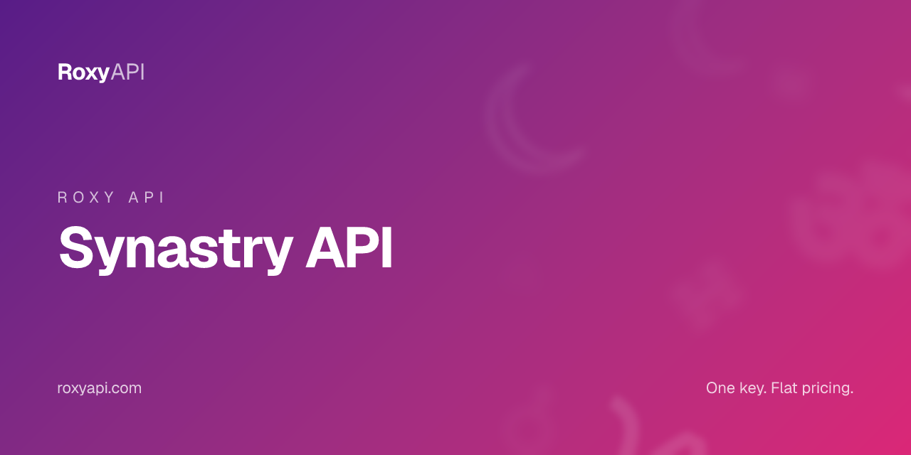

[](https://roxyapi.com/products/astrology-api)

# Synastry API

> Full inter-aspect analysis between two natal charts plus a weighted compatibility score. One key covers 12+ spiritual domains. MCP-first, verified against NASA JPL Horizons.

[](https://roxyapi.com/pricing)
[](https://roxyapi.com/api-reference)
[](https://roxyapi.com/methodology)
[](https://roxyapi.com/docs/mcp)
[](https://roxyapi.com/docs/sdk)

## What is Synastry API

Synastry is the branch of astrology that examines the inter-chart aspects between two people. This repo ships working TypeScript, JavaScript, and Python samples against the RoxyAPI synastry endpoint. One subscription unlocks 12+ spiritual domains: Western astrology, Vedic astrology, numerology, tarot, Human Design, Forecast, biorhythm, I Ching, crystals, dreams, angel numbers, and location. Every planetary position is computed by Roxy Ephemeris, verified against NASA JPL Horizons. The synastry response returns a compatibility score (0-100), every inter-aspect with orb and strength, and a narrative analysis split into relationship strengths and challenges.

## Why this API

| Property | Value |
|----------|-------|
| Coverage | 12+ spiritual domains in one subscription |
| Calculation | Roxy Ephemeris, verified against NASA JPL Horizons |
| MCP server | `https://roxyapi.com/mcp/astrology` (Streamable HTTP, no local setup) |
| SDKs | TypeScript on npm `@roxyapi/sdk`, Python on PyPI `roxy-sdk`, PHP on Packagist `roxyapi/sdk`, C# on NuGet `RoxyApi.Sdk`, Go `github.com/RoxyAPI/sdk-go`, WordPress plugin `roxyapi` |
| Pricing | One key, flat per call, $39 for 25K calls |
| Licensing | Personal and commercial use, including closed source apps. No AGPL or GPL entanglement. [Full terms](https://roxyapi.com/policy/license) |
| Last verified | 2026-Q3 |

## Quick start

1. Get a key at [roxyapi.com/pricing](https://roxyapi.com/pricing)
2. Pick a language below
3. Copy the snippet, run, ship

### cURL

```bash
curl -X POST https://roxyapi.com/api/v2/astrology/synastry \
  -H "X-API-Key: $ROXY_API_KEY" \
  -H "Content-Type: application/json" \
  -d '{
    "person1": {
      "name": "Alex",
      "date": "1990-03-21",
      "time": "08:15:00",
      "latitude": 40.7128,
      "longitude": -74.006,
      "timezone": "America/New_York"
    },
    "person2": {
      "name": "Jordan",
      "date": "1992-08-14",
      "time": "14:30:00",
      "latitude": 51.5074,
      "longitude": -0.1278,
      "timezone": "Europe/London"
    }
  }'
```

### Python

```python
import os
from roxy_sdk import create_roxy

roxy = create_roxy(os.environ["ROXY_API_KEY"])

# Synastry: always geocode both birth cities first
loc1 = roxy.location.search_cities(q="New York")
city1 = loc1["cities"][0]

loc2 = roxy.location.search_cities(q="London")
city2 = loc2["cities"][0]

# Synastry analysis between two people
result = roxy.astrology.calculate_synastry(
    person1={
        "name": "Alex",
        "date": "1990-03-21",
        "time": "08:15:00",
        "latitude": city1["latitude"],
        "longitude": city1["longitude"],
        "timezone": city1["timezone"],
    },
    person2={
        "name": "Jordan",
        "date": "1992-08-14",
        "time": "14:30:00",
        "latitude": city2["latitude"],
        "longitude": city2["longitude"],
        "timezone": city2["timezone"],
    },
)

print(result["compatibilityScore"])
for aspect in result["interAspects"][:3]:
    print(aspect["planet1"], "->", aspect["planet2"], aspect["type"], "orb:", aspect["orb"])
```

### JavaScript (Node)

```js
import { createRoxy } from '@roxyapi/sdk';

const roxy = createRoxy(process.env.ROXY_API_KEY);

// Synastry: geocode both birth cities first, then compute inter-chart aspects
const { data: loc1 } = await roxy.location.searchCities({ query: { q: 'New York' } });
const { data: loc2 } = await roxy.location.searchCities({ query: { q: 'London' } });

const { data, error } = await roxy.astrology.calculateSynastry({
  body: {
    person1: {
      name: 'Alex',
      date: '1990-03-21',
      time: '08:15:00',
      latitude: loc1.cities[0].latitude,
      longitude: loc1.cities[0].longitude,
      timezone: loc1.cities[0].timezone,
    },
    person2: {
      name: 'Jordan',
      date: '1992-08-14',
      time: '14:30:00',
      latitude: loc2.cities[0].latitude,
      longitude: loc2.cities[0].longitude,
      timezone: loc2.cities[0].timezone,
    },
  },
});

if (error) throw new Error(error.error);

console.log('Compatibility score:', data.compatibilityScore);
data.interAspects.slice(0, 3).forEach(a =>
  console.log(`${a.planet1} -> ${a.planet2} ${a.type} orb: ${a.orb}`)
);
```

### TypeScript

```ts
import { createRoxy } from '@roxyapi/sdk';

const roxy = createRoxy(process.env.ROXY_API_KEY!);

// Synastry: geocode both birth cities, then run full inter-aspect analysis
const { data: loc1 } = await roxy.location.searchCities({ query: { q: 'New York' } });
const { data: loc2 } = await roxy.location.searchCities({ query: { q: 'London' } });

const { data, error } = await roxy.astrology.calculateSynastry({
  body: {
    person1: {
      name: 'Alex',
      date: '1990-03-21',
      time: '08:15:00',
      latitude: loc1.cities[0].latitude,
      longitude: loc1.cities[0].longitude,
      timezone: loc1.cities[0].timezone,
    },
    person2: {
      name: 'Jordan',
      date: '1992-08-14',
      time: '14:30:00',
      latitude: loc2.cities[0].latitude,
      longitude: loc2.cities[0].longitude,
      timezone: loc2.cities[0].timezone,
    },
  },
});

if (error) throw new Error(error.error);

console.log('Compatibility score:', data.compatibilityScore);
console.log('Total inter-aspects:', data.summary.total);
data.interAspects.slice(0, 3).forEach(a =>
  console.log(`${a.planet1} -> ${a.planet2} ${a.type} orb: ${a.orb} strength: ${a.strength}`)
);
console.log('Strengths:', data.analysis.strengths);
console.log('Challenges:', data.analysis.challenges);
```

## Request schema

| Field | Type | Required | Description |
|-------|------|----------|-------------|
| `person1` | object | yes | First person birth data. Contains `date`, `time`, `latitude`, `longitude`, `timezone`, and optional `name` |
| `person1.date` | string | yes | Birth date YYYY-MM-DD |
| `person1.time` | string | yes | Birth time HH:MM:SS (24-hour). Determines the Ascendant. Use 12:00:00 if unknown |
| `person1.latitude` | number | yes | Birth latitude -90 to 90. Call `/location/search` to get this |
| `person1.longitude` | number | yes | Birth longitude -180 to 180. Call `/location/search` to get this |
| `person1.timezone` | number or string | yes | UTC offset (e.g. -5) or IANA name (e.g. "America/New_York"). Pass `cities[0].timezone` from `/location/search` directly |
| `person1.name` | string | no | Display name included in the response |
| `person2` | object | yes | Second person birth data. Same shape as `person1` |
| `houseSystem` | string | no | `placidus` (default), `whole-sign`, `equal`, or `koch` |

## Response shape

```json
{
  "person1": {
    "name": "Alex",
    "ascendant": { "sign": "Taurus", "degree": 15.32 },
    "sunSign": "Aries",
    "moonSign": "Gemini"
  },
  "person2": {
    "name": "Jordan",
    "ascendant": { "sign": "Virgo", "degree": 22.18 },
    "sunSign": "Leo",
    "moonSign": "Scorpio"
  },
  "compatibilityScore": 78,
  "interAspects": [
    {
      "planet1": "Venus",
      "planet2": "Mars",
      "type": "TRINE",
      "angle": 120,
      "orb": 2.5,
      "strength": 75,
      "interpretation": "harmonious",
      "meaning": {
        "name": "Trine",
        "description": { "short": "Natural flow", "long": "..." },
        "keywords": ["harmony", "ease", "attraction"],
        "nature": "harmonious",
        "relationshipContext": "..."
      }
    }
  ],
  "summary": {
    "total": 24,
    "harmonious": 12,
    "challenging": 8,
    "neutral": 4,
    "byType": { "TRINE": 5, "SEXTILE": 7, "SQUARE": 6, "OPPOSITION": 2 }
  },
  "analysis": {
    "overall": "...",
    "strengths": ["Strong Venus-Mars attraction", "..."],
    "challenges": ["Saturn square Moon tension", "..."]
  }
}
```

| Field | Type | Description |
|-------|------|-------------|
| `person1` | object | Chart highlights: `ascendant` (sign and degree), `sunSign`, `moonSign` |
| `person2` | object | Same shape as `person1` |
| `compatibilityScore` | number | Overall compatibility 0-100. Weighted by harmonious vs challenging inter-aspects and planet importance |
| `interAspects` | array | Every inter-chart aspect between person 1 and person 2 planets. Each entry has `planet1`, `planet2`, `type`, `angle`, `orb`, `strength`, `interpretation`, and `meaning` |
| `interAspects[].orb` | number | Distance from exact aspect in degrees. Tighter orb means stronger influence |
| `interAspects[].strength` | number | Aspect strength 0-100 based on orb tightness |
| `interAspects[].interpretation` | string | `harmonious`, `challenging`, or `neutral` |
| `summary` | object | Aspect count totals: `total`, `harmonious`, `challenging`, `neutral`, `byType` |
| `analysis.overall` | string | Narrative relationship assessment |
| `analysis.strengths` | array | Areas where the relationship naturally thrives |
| `analysis.challenges` | array | Friction points and growth opportunities |

## Common use cases

| Use case | Endpoint flow |
|----------|---------------|
| Dating app match card with compatibility score | Call `/location/search` twice, then POST to `/astrology/synastry`. Display `compatibilityScore` |
| Full synastry report for a relationship astrologer tool | Show `interAspects[]` sorted by `strength` descending |
| Relationship strength analysis | Read `analysis.strengths` and `analysis.challenges` for narrative copy |
| Aspect grid table (classic astrology UI) | Pivot `interAspects[]` by `planet1` and `planet2` for a grid view |
| Find strongest connections between two charts | Filter `interAspects` by `strength > 80` and `interpretation == "harmonious"` |

## Related endpoints in this domain

- `POST /astrology/compatibility-score` (`calculateCompatibility`) - lighter compatibility percent with sign-level blocks, no full inter-aspect table
- `POST /astrology/natal-chart` (`generateNatalChart`) - full natal chart per person with planet sign, house, and interpretation
- `POST /astrology/transits` (`calculateTransits`) - current sky transits to a natal chart for live timing overlays

## Use this in your AI agent

Connect Claude, GPT, Gemini, or Cursor to RoxyAPI through the remote MCP server. No Docker. No self hosting. The full MCP tool catalog for this domain is at `https://roxyapi.com/mcp/astrology`.

```json
{
  "mcpServers": {
    "astrology": {
      "url": "https://roxyapi.com/mcp/astrology",
      "headers": { "X-API-Key": "$ROXY_API_KEY" }
    }
  }
}
```

See [docs/mcp](https://roxyapi.com/docs/mcp) for Claude Desktop, Cursor, Windsurf, VS Code, and Claude Code setup.

## For AI coding agents

This repo ships an [AGENTS.md](AGENTS.md) execution playbook. Cursor, Claude Code, Aider, Codex, Windsurf, RooCode, and Gemini CLI will pick it up automatically. Top level overview lives at [roxyapi.com/AGENTS.md](https://roxyapi.com/AGENTS.md).

## Resources

- [Methodology and gold standard tests](https://roxyapi.com/methodology) verified against NASA JPL Horizons
- [Full API reference](https://roxyapi.com/api-reference) interactive Scalar UI
- [TypeScript SDK on npm](https://www.npmjs.com/package/@roxyapi/sdk)
- [Python SDK on PyPI](https://pypi.org/project/roxy-sdk/)
- [PHP SDK on Packagist](https://packagist.org/packages/roxyapi/sdk)
- [C# SDK on NuGet](https://www.nuget.org/packages/RoxyApi.Sdk)
- [Go SDK on pkg.go.dev](https://pkg.go.dev/github.com/RoxyAPI/sdk-go)
- [WordPress plugin](https://wordpress.org/plugins/roxyapi/)
- [llms.txt](https://roxyapi.com/llms.txt) full LLM citation index
- [Top level AGENTS.md](https://roxyapi.com/AGENTS.md)

## Other RoxyAPI samples

[](https://github.com/RoxyAPI/kp-astrology-api)
[](https://github.com/RoxyAPI/natal-chart-api)
[](https://github.com/RoxyAPI/daily-horoscope-api)
[](https://github.com/RoxyAPI/kundli-api)
[](https://github.com/RoxyAPI/numerology-api)

## License

MIT for this sample repo. See [LICENSE](LICENSE).

**Catalog licensing:** Personal and commercial use, including closed source proprietary apps. No AGPL or GPL entanglement. RoxyAPI APIs and SDKs are safe to embed in commercial products. Full terms at [roxyapi.com/policy/license](https://roxyapi.com/policy/license).

## Contact

- Site: [roxyapi.com](https://roxyapi.com)
- Status: [roxyapi.com/api-reference](https://roxyapi.com/api-reference)
